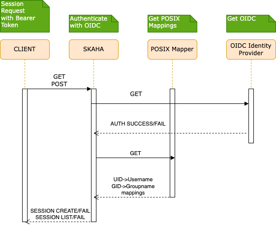
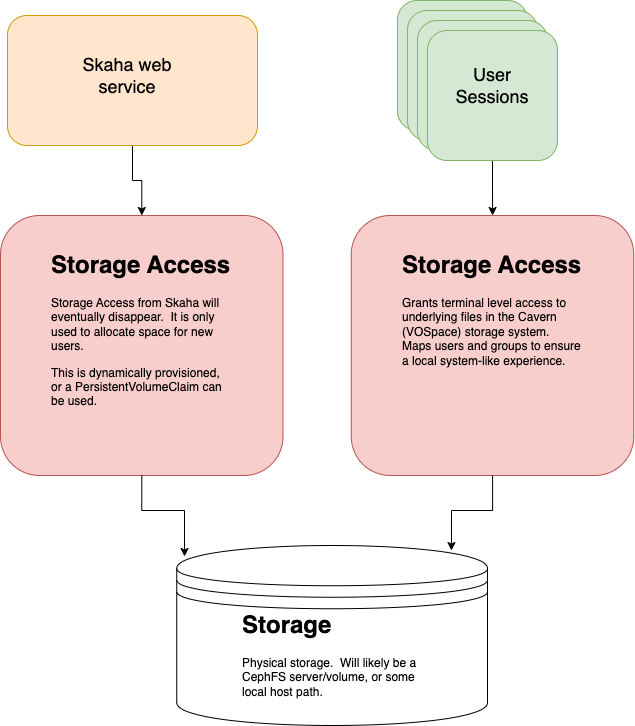

# Deployment Guide

[TOC]

## Dependencies

Install and configure these **before** the platform application charts.

- A Kubernetes cluster (1.29+).
- An [IVOA Service Registry](https://github.com/opencadc/reg/tree/master/reg) deployment.
- **Traefik** v2.11 or newer with the Kubernetes CRD provider enabled. Skaha user sessions and several platform charts rely on Traefik `IngressRoute` and `Middleware` objects (`traefik.io/v1alpha1`). Standard `Ingress` resources (Cavern, POSIX Mapper, Science Portal, and others) also expect an ingress class of `traefik`. See [Traefik install](#traefik-install) below.
- **Namespaces** `skaha-system` (APIs and UIs) and `skaha-workload` (user session pods). Create them yourself, or let the Skaha chart create `skaha-workload` when `deployment.skaha.sessions.namespace.create` is `true`.
- **Shared storage** PersistentVolumes and PersistentVolumeClaims in both namespaces (see [Persistent Volumes and Persistent Volume Claims](#persistent-volumes-and-persistent-volume-claims)).

### Kueue (recommended)

[Kueue](https://kueue.sigs.k8s.io/) is a Kubernetes-native job queue for user sessions. It is optional but strongly recommended for production.

See https://kueue.sigs.k8s.io/docs/installation/#install-a-released-version for upstream details.

#### Install Kueue

```bash
helm -n kueue-system install kueue oci://registry.k8s.io/kueue/charts/kueue --create-namespace
```

#### ClusterQueue

A `ClusterQueue` is a cluster-wide queue template. An example is in [Skaha Example Kueue ClusterQueue](https://github.com/opencadc/science-platform/blob/main/helm/kueue/examples/clusterQueue.config.yaml). Adjust for your cluster, then apply:

```bash
git clone https://github.com/opencadc/science-platform.git
cp science-platform/helm/kueue/examples/clusterQueue.config.yaml ./
# Edit as needed.
kubectl apply -f ./clusterQueue.config.yaml
```

#### LocalQueue

A `LocalQueue` is namespace-scoped and must exist in the workload namespace (`skaha-workload` by default). See [Skaha Example Kueue LocalQueue](https://github.com/opencadc/science-platform/blob/main/helm/kueue/examples/localQueue.config.yaml).

```bash
git clone https://github.com/opencadc/science-platform.git
cp science-platform/helm/kueue/examples/localQueue.config.yaml ./
# Edit as needed.
kubectl apply -f ./localQueue.config.yaml
```

#### Kueue RBAC

Additional RBAC lets Skaha and session workloads interact with Kueue. This is separate from the RBAC the [Skaha](skaha.md) chart creates for session management (Jobs, Pods, `IngressRoute`, and `Middleware` in `skaha-workload`).

Example manifests: [Skaha Example Kueue RBAC](https://github.com/opencadc/science-platform/blob/main/helm/kueue/examples/rbac.yaml).

```bash
git clone https://github.com/opencadc/science-platform.git
cp science-platform/helm/kueue/examples/rbac.yaml ./
kubectl apply -f ./rbac.yaml
```

### Traefik install

Traefik must be running **before** you install Skaha. The Skaha chart renders `IngressRoute` and `Middleware` resources for interactive sessions (notebooks, CARTA, desktops, and similar). Platform `Ingress` objects use `ingressClassName: traefik`.

Use Traefik **v2.11.0** or newer. The charts use API group `traefik.io` (not the older `traefik.containo.us` group).

```bash
helm repo add traefik https://traefik.github.io/charts
helm repo update

helm upgrade --install traefik traefik/traefik \
  -n traefik --create-namespace \
  --set providers.kubernetesCRD.enabled=true \
  --set providers.kubernetesCRD.allowCrossNamespace=true \
  --set providers.kubernetesIngress.enabled=true \
  --set providers.kubernetesIngress.ingressClass=traefik \
  --set ingressClass.enabled=true \
  --set ingressClass.isDefaultClass=false \
  --set ingressClass.name=traefik
```

!!! tip "TLS termination"

    For HTTPS with your own certificate, create a TLS Secret in the `traefik` namespace and configure Traefik’s default certificate or per-route TLS. The obsolete [Base](base.md) chart documented this pattern under `secrets.default-certificate` and `traefik.tlsStore`; the same approach applies when Traefik is installed standalone.

Verify the controller is ready:

```bash
kubectl -n traefik get pods
kubectl get ingressclass traefik
```

## Base chart (obsolete)

The [`base`](base.md) Helm chart (`science-platform/base`) is **obsolete for new deployments**. It previously bundled:

- Traefik installation
- `skaha-system` / `skaha-workload` namespace creation
- RBAC for the Skaha service account

**New installs** should use [Traefik install](#traefik-install), create namespaces explicitly (or via Skaha values), and rely on RBAC from the [Skaha](skaha.md) chart (`rbac.create`, enabled by default).

**Existing deployments** may keep the `base` release to avoid churn. If you still use it, only the Traefik and namespace behaviour above is relevant; do not install `base` again on greenfield clusters.

```bash
# Legacy only — not required for new Science Platform installs
helm upgrade --install -n traefik --create-namespace \
  --values my-base-local-values-file.yaml base science-platform/base
```

## Quick Start

After [Traefik](#traefik-install), namespaces, storage, and optional Kueue are in place:

```bash
helm repo add science-platform https://images.opencadc.org/chartrepo/platform
helm repo add science-platform-client https://images.opencadc.org/chartrepo/client
helm repo update

helm upgrade --install -n skaha-system --create-namespace --values my-posix-mapper-local-values-file.yaml posix-mapper science-platform/posixmapper
helm upgrade --install -n skaha-system --values my-cavern-local-values-file.yaml cavern science-platform/cavern
helm upgrade --install -n skaha-system --values my-skaha-local-values-file.yaml skaha science-platform/skaha
helm upgrade --install -n skaha-system --values my-science-portal-local-values-file.yaml science-portal science-platform/science-portal
helm upgrade --install -n skaha-system --values my-storage-ui-local-values-file.yaml storage-ui science-platform-client/storageui
```

## Persistent Volumes and Persistent Volume Claims

There are two (2) Persistent Volume Claims that are used in the system, due to the fact that there are two (2) Namespaces (`skaha-system` and `skaha-workload`).  These PVCs, while
having potentially different configurations, **must** point to the same storage.  For example, if two `hostPath` PVCs are created, the `hostPath.path` **must** point to the same
folder in order to have shared content between the Cavern Service (`cavern`) and the User Sessions (Notebooks, CARTA, etc.).

Create the `skaha-system` and `skaha-workload` namespaces if they do not exist yet:

```bash
kubectl create namespace skaha-system
kubectl create namespace skaha-workload
```

It is expected that the deployer, or an Administrator, will create the necessary Persistent Volumes (if needed), and the required Persistent Volume Claims at
this point. Sample [local PersistentVolume manifests](https://github.com/opencadc/science-platform/tree/master/deployment/helm/base/volumes) are in the upstream `base/volumes` folder (historical reference from the obsolete base chart).

Two (2) Persistent Volume Claims are required.  While both point to the same underlying storage, they are in different Namespaces.  This leads to somewhat duplicated effort, but it is necessary to ensure that both the `skaha-system` and `skaha-workload` namespaces have access to the required storage resources.
See this [short explanation](https://youtu.be/NSO0HioWLiI) for more information.


### POSIX Mapper install

The [POSIX Mapper Service](posix-mapper) is required to provide a UID to Username mapping, and a GID to Group Name mapping so that any Terminal access properly showed System Users in User Sessions.  It will generate UIDs when a user is requested, or a GID when a Group is requested, and then keep track of them.

This service is required to be installed _before_ the Skaha service.

Create a `my-posix-mapper-local-values-file.yaml` file to override Values from the main [template `values.yaml` file](https://github.com/opencadc/deployments/tree/main/helm/applications/posix-mapper/values.yaml).

`my-posix-mapper-local-values-file.yaml`
```yaml
# POSIX Mapper web service deployment
deployment:
  hostname: example.org
  posixMapper:
    # Optionally set the DEBUG port.
    # extraEnv:
    # - name: CATALINA_OPTS
    #   value: "-agentlib:jdwp=transport=dt_socket,server=y,suspend=n,address=0.0.0.0:5555"
    # - name: JAVA_OPTS
    #   value: "-agentlib:jdwp=transport=dt_socket,server=y,suspend=n,address=0.0.0.0:5555"

    # Uncomment to debug.  Requires options above as well as service port exposure below.
    # extraPorts:
    # - containerPort: 5555
    #   protocol: TCP

    # Resources provided to the Skaha service.
    resources:
      requests:
        memory: "1Gi"
        cpu: "500m"
      limits:
        memory: "1Gi"
        cpu: "500m"

    # Used to set the minimum UID.  Useful to avoid conflicts.
    minUID: 10000

    # Used to set the minimum GID.  Keep this much higher than the minUID so that default Groups can be set for new users.
    minGID: 900000

    # The URL of the IVOA Registry
    registryURL: https://example.org/reg

    # Optionally mount a custom CA certificate
    # extraVolumeMounts:
    # - mountPath: "/config/cacerts"
    #   name: cacert-volume

    # Create the CA certificate volume to be mounted in extraVolumeMounts
    # extraVolumes:
    # - name: cacert-volume
    #   secret:
    #     defaultMode: 420
    #     secretName: posix-manager-cacert-secret

  # Specify extra hostnames that will be added to the Pod's /etc/hosts file.  Note that this is in the
  # deployment object, not the posixMapper one.
  #
  # These entries get added as hostAliases entries to the Deployment.
  #
  # Example:
  # extraHosts:
  #   - ip: 127.3.34.5
  #     hostname: myhost.example.org
  #
  # extraHosts: []

secrets:
  # Uncomment to enable local or self-signed CA certificates for your domain to be trusted.
#   posix-manager-cacert-secret:
#     ca.crt: <base64 encoded ca crt>

# These values are preset in the catalina.properties, and this default database only exists beside this service.
postgresql:
#   maxActive: 4
#   schema: mapping
#   url: jdbc:postgresql://db.host:5432/mapping
#   auth:
#     username: posixmapperuser
#     password: posixmapperpwd
```

```bash
helm -n skaha-system upgrade --install  --values my-posix-mapper-local-values-file.yaml posix-mapper science-platform/posixmapper

NAME: posix-mapper
LAST DEPLOYED: Thu Oct 28 07:28:45 2025
NAMESPACE: skaha-system
STATUS: deployed
REVISION: 1
```

Test it.
```bash
# See below for tokens
export SKA_TOKEN=...
curl -SsL --header "Authorization: Bearer ${SKA_TOKEN}" https://example.host.com/posix-mapper/uid
[]%

curl -SsL --header "Authorization: Bearer ${SKA_TOKEN}" "https://example.host.com/posix-mapper/uid?user=mynewuser"
mynewuser:x:10000:10000:::
```

### Cavern (User Storage API) install

The Cavern API provides access to the User Storage which is shared between Skaha and all of the User Sessions.  A [Bearer token](#obtaining-a-bearer-token) is required when trying to read
private access, or any writing.

Create a `my-cavern-local-values-file.yaml` file to override Values from the main [template `values.yaml` file](https://github.com/opencadc/deployments/tree/main/helm/applications/cavern/values.yaml).

`my-cavern-local-values-file.yaml`
```yaml
# Cavern web service deployment
deployment:
  hostname: example.org
  cavern:
    # How cavern identifies itself.  Required.
    resourceID: "ivo://example.org/cavern"

    # Set the Registry URL pointing to the desired registry.  Required
    registryURL: "https://example.org/reg"

    # How to find the POSIX Mapper API.  URI (ivo://) or URL (https://).  Required.
    posixMapperResourceID: "ivo://example.org/posix-mapper"

    # User Allocation settings.  This is used to create new folders under the main root allocation folders, namely /home and /projects.
    allocations:
      # Required.  The default size, in GB, of an allocation.  This is used in the absence of the Quota VOSpace property.  Can be a floating point number.
      # Provided value is 10 (10 GiB) by default.
      # Example:
      #   defaultSizeGB: 25.5
      defaultSizeGB: 25

    filesystem:
      # persistent data directory in container
      dataDir: # e.g. "/data"

      # RELATIVE path to the node/file content that could be mounted in other containers
      subPath: # e.g. "cavern"

      # See https://github.com/opencadc/vos/tree/master/cavern for documentation.  For deployments using OpenID Connect,
      # the rootOwner MUST be an object with the following properties set.
      rootOwner:
        # The adminUsername is required to be set whomever has admin access over the filesystem.dataDir above.
        adminUsername:

        # The username of the root owner.
        username:

        # The UID of the root owner.
        uid:

        # The GID of the root owner.
        gid:

    # Further UWS settings for the Tomcat Pool setup.  Set uws.db.install to false and set uws.db.url, with uws.db.auth.existingSecret for credentials (not in Git).
    uws:
      db:
        install: true
        schema: uws
        maxActive: 2
        auth:
          existingSecret: cavern-uws-db

    # Optional rename of the application from the default "cavern"
    # applicationName: "cavern"

    # The endpoint to serve this from.  Defaults to /cavern.  If the applicationName is changed, then this should match.
    # Don't forget to update your registry entries!
    #
    # endpoint: "/cavern"

    # Simple Class name of the QuotaPlugin to use.  This is used to request quota and folder size information
    # from the underlying storage system.  Optional, defaults to NoQuotaPlugin.
    #
    # - For CephFS deployments: CephFSQuotaPlugin
    # - Default: NoQuotaPlugin
    #
    # quotaPlugin: {NoQuotaPlugin | CephFSQuotaPlug}

    # Optionally set the DEBUG port.
    #
    # Example:
    # extraEnv:
    # - name: CATALINA_OPTS
    #   value: "-agentlib:jdwp=transport=dt_socket,server=y,suspend=n,address=0.0.0.0:5555"
    # - name: JAVA_OPTS
    #   value: "-agentlib:jdwp=transport=dt_socket,server=y,suspend=n,address=0.0.0.0:5555"
    #
    # extraEnv:

    # Optionally mount a custom CA certificate
    # Example:
    # extraVolumeMounts:
    # - mountPath: "/config/cacerts"
    #   name: cacert-volume
    #
    # extraVolumeMounts:

    # Create the CA certificate volume to be mounted in extraVolumeMounts
    # Example:
    # extraVolumes:
    # - name: cacert-volume
    #   secret:
    #     defaultMode: 420
    #     secretName: cavern-cacert-secret
    #
    # extraVolumes:

    # Other data to be included in the main ConfigMap of this deployment.
    # Of note, files that end in .key are special and base64 decoded.
    #
    # extraConfigData:

    # Resources provided to the Cavern service.
    resources:
      requests:
        memory: "1Gi"
        cpu: "500m"
      limits:
        memory: "1Gi"
        cpu: "500m"

    # Optionally describe how this Pod will be scheduled using the nodeAffinity clause. This applies to Cavern.
    # See https://kubernetes.io/docs/tasks/configure-pod-container/assign-pods-nodes-using-node-affinity/
    # Example:
    nodeAffinity:
      # Only allow Cavern to run on specific Nodes.
      requiredDuringSchedulingIgnoredDuringExecution:
        nodeSelectorTerms:
        - matchExpressions:
          - key: kubernetes.io/hostname
            operator: In
            values:
            - my-special-api-host

  # Specify extra hostnames that will be added to the Pod's /etc/hosts file.  Note that this is in the
  # deployment object, not the cavern one.
  #
  # These entries get added as hostAliases entries to the Deployment.
  #
  # Example:
  # extraHosts:
  #   - ip: 127.3.34.5
  #     hostname: myhost.example.org
  #
  # extraHosts: []

# secrets:
  # Uncomment to enable local or self-signed CA certificates for your domain to be trusted.
  # cavern-cacert-secret:
  #   ca.crt: <base64 encoded CA crt>

# Set these appropriately to match your Persistent Volume Claim labels.
storage:
  service:
    spec:
      # YAML for service mounted storage.
      # Example is the persistentVolumeClaim below.  This should match whatever Skaha used.
      # persistentVolumeClaim:
      #   claimName: skaha-pvc
```

### Skaha install

Install Skaha **after** Traefik, POSIX Mapper, and Cavern. The chart creates the Skaha service account RBAC (Jobs, Pods, `IngressRoute`, `Middleware` in the workload namespace, and related permissions) when `rbac.create` is `true` (default). Optional Kueue integration RBAC is configured under `deployment.skaha.sessions.kueue.rbac` or via the [Kueue RBAC](#kueue-rbac) manifests above.

!!! note "Chart source"

    The Skaha Helm chart lives alongside the service in [`opencadc/science-platform`](https://github.com/opencadc/science-platform) (`helm/`). Install from the published chart `science-platform/skaha`, or use that directory when developing the chart.

The Skaha service will manage User Sessions.  It relies on the POSIX Mapper being deployed, and available to be found
via the IVOA Registry:

`/reg/resource-caps`
```
...
# Ensure the hostname matches the deployment hostname.
ivo://example.org/posix-mapper = https://example.host.com/posix-mapper/capabilities
...
```

Create a `my-skaha-local-values-file.yaml` file to override Values from the main [template `values.yaml`](https://github.com/opencadc/science-platform/blob/main/helm/values.yaml) in `opencadc/science-platform` (see also the [Skaha](skaha.md) chart page).

`my-skaha-local-values-file.yaml`
```yaml
# Skaha web service deployment
deployment:
  hostname: example.org
  skaha:
    # Optionally set the DEBUG port.
    # extraEnv:
    # - name: CATALINA_OPTS
    #   value: "-agentlib:jdwp=transport=dt_socket,server=y,suspend=n,address=0.0.0.0:5555"
    # - name: JAVA_OPTS
    #   value: "-agentlib:jdwp=transport=dt_socket,server=y,suspend=n,address=0.0.0.0:5555"

    # Uncomment to debug.  Requires options above as well as service port exposure below.
    # extraPorts:
    # - containerPort: 5555
    #   protocol: TCP

    defaultQuotaGB: "10"

    # Space delimited list of allowed Image Registry hosts.  These hosts should match the hosts in the User Session images.
    registryHosts: "images.canfar.net"

    # The IVOA GMS Group URI to verify images without contacting Harbor.
    # See https://www.ivoa.net/documents/GMS/20220222/REC-GMS-1.0.html#tth_sEc3.2
    adminsGroup: "ivo://example.org/gms?skaha-admin-users"

    # The IVOA GMS Group URI to verify users against for permission to run headless jobs.
    # See https://www.ivoa.net/documents/GMS/20220222/REC-GMS-1.0.html#tth_sEc3.2
    headlessGroup: "ivo://example.org/gms?skaha-headless-users"

    # The IVOA GMS Group URI to verify users against that have priority for their headless jobs.
    # See https://www.ivoa.net/documents/GMS/20220222/REC-GMS-1.0.html#tth_sEc3.2
    headlessPriorityGroup: "ivo://example.org/gms?skaha-priority-headless-users"

    # Class name to set for priority headless jobs.
    headlessPriorityClass: "uber-user-vip"

    # Array of GMS Group URIs allowed to set the logging level.  If none set, then nobody can change the log level.
    # See https://www.ivoa.net/documents/GMS/20220222/REC-GMS-1.0.html#tth_sEc3.2 for GMS Group URIs
    # See https://github.com/opencadc/core/tree/main/cadc-log for Logging control
    loggingGroups:
      - "ivo://example.org/gms?skaha-logging-admin-users"

    # The Resource ID (URI) of the Service that contains the Posix Mapping information
    posixMapperResourceID: "ivo://example.org/posix-mapper"

    # URI or URL of the OIDC (IAM) server.  Used to validate incoming tokens.
    oidcURI: https://iam.example.org/

    # The Resource ID (URI) of the GMS Service.
    gmsID: ivo://example.org/gms

    # The absolute URL of the IVOA Registry where services are registered
    registryURL: https://example.org/reg

    # Optionally describe how this Pod will be scheduled using the nodeAffinity clause. This applies to Skaha itself.
    # Note the different indentation level compared to the sessions.nodeAffinity.
    # See https://kubernetes.io/docs/tasks/configure-pod-container/assign-pods-nodes-using-node-affinity/
    # See the [Sample Skaha Values file](skaha/sample-local-values.yaml).
    # Example:
    nodeAffinity:
      # Only allow Skaha to run on specific Nodes.
      requiredDuringSchedulingIgnoredDuringExecution:
        nodeSelectorTerms:
        - matchExpressions:
          - key: kubernetes.io/hostname
            operator: In
            values:
            - my-special-node-host

    # Settings for User Sessions.  Sensible defaults supplied, but can be overridden.
    # For units of storage, see https://kubernetes.io/docs/concepts/configuration/manage-resources-containers/#meaning-of-memory.
    sessions:
      expirySeconds: "345600"   # Duration, in seconds, until they expire and are shut down.
      maxCount: "3"  # Max number of sessions per user.
      minEphemeralStorage: "20Gi"   # The initial requested amount of ephemeral (local) storage.  Does NOT apply to Desktop sessions.
      maxEphemeralStorage: "200Gi"  # The maximum amount of ephemeral (local) storage to allow a Session to extend to.  Does NOT apply to Desktop sessions.

      # Platform access — prefer deployment.skaha.sessions.authorization; deployment.skaha.usersGroup is deprecated when group.enabled / permissionsAPI.enabled are unset.
      # Deployments receive SKAHA_SESSIONS_AUTHORIZATION_GROUP_ENABLED and SKAHA_SESSIONS_AUTHORIZATION_PERMISSIONS_API_ENABLED plus mode-specific env vars.
      # See https://www.ivoa.net/documents/GMS/20220222/REC-GMS-1.0.html#tth_sEc3.2
      authorization:
        group:
          enabled: true
          uri: "ivo://example.org/gms?skaha-platform-users"
      # Alternative (Permissions API instead of GMS group):
      # authorization:
      #   permissionsAPI:
      #     enabled: true
      #     baseURL: "https://permissions.example.org/api"
      #     type: "route"
      #     name: "skaha"

      # Optionally setup a separate host for User Sessions for Skaha to redirect to.  The HTTPS scheme is assumed.  Defaults to the Skaha hostname (.Values.deployment.hostname).
      # Example:
      #   hostname: myhost.example.org
      hostname: sessions.example.org

      # When set to 'true' this flag will enable GPU node scheduling.  Don't forget to declare any related GPU configurations, if appropriate, in the nodeAffinity below!
      # gpuEnabled: false

      # Optionally set the node label selector to identify Kubernetes Worker Nodes.  This is used to accurately query for available
      # resources from schedulable Nodes by eliminating, for example, Nodes that are only cordoned for Web APIs.
      # Example:
      #   nodeLabelSelector: "node-role.kubernetes.io/node-type=worker"
      #
      # Example (multiple labels ANDed):
      #   nodeLabelSelector: "node-role.kubernetes.io/node-type=worker,environment=production"
      #
      #
      # Example (multiple labels ORed):
      #   nodeLabelSelector: "node-role.kubernetes.io/node-type in (worker,worker-gpu)"
      nodeLabelSelector:

      userStorage:
        spec:
          persistentVolumeClaim:
            claimName: skaha-workload-cavern-pvc
        nodeURIPrefix: "vos://canfar.net~src~cavern"
        serviceURI: "ivo://canfar.net/src/cavern"

      # Set the YAML that will go into the "affinity.nodeAffinity" stanza for Pod Spec in User Sessions.  This can be used to enable GPU scheduling, for example,
      # or to control how and where User Session Pods are scheduled.  This can be potentially dangerous unless you know what you are doing.
      # See https://kubernetes.io/docs/tasks/configure-pod-container/assign-pods-nodes-using-node-affinity
      # nodeAffinity: {}

      # Mount CVMFS from the Node's mounted path into all User Sessions.
      extraVolumes:
      - name: cvmfs-mount
        volume:
          type: HOST_PATH     # HOST_PATH is for host path
          hostPath: "/cvmfs"  # Path on the Node to look for a source folder
          hostPathType: Directory
        volumeMount:
          mountPath: "/cvmfs"   # Path to mount on the User Sesssion Pod.
          readOnly: false
          mountPropagation: HostToContainer

      # Kueue configurations for User Sessions
      kueue:
        default:
          # Ensure this name matches whatever was created as the LocalQueue in the workload namespace.
          queueName: canfar-science-platform-local-queue
          priorityClass: low

      limitRange:
        create: true
        enabled: true
        rbac:
          create: false
        spec:
          max:  # maximum allowed requested
            memory: "192Gi"
            cpu: "16"
            nvidia.com/gpu: "1"
          default:  # actually refers to default limits
            memory: "24Gi"
            cpu: "4"
            nvidia.com/gpu: "0"
          defaultRequest:  # default requests
            memory: "4Gi"
            cpu: "1"
            nvidia.com/gpu: "0"

    # Optionally mount a custom CA certificate as an extra mount in Skaha (*not* user sessions)
    # extraVolumeMounts:
    # - mountPath: "/config/cacerts"
    #   name: cacert-volume

    # Create the CA certificate volume to be mounted in extraVolumeMounts
    # extraVolumes:
    # - name: cacert-volume
    #   secret:
    #     defaultMode: 420
    #     secretName: skaha-cacert-secret

    # Other data to be included in the main ConfigMap of this deployment.
    # Of note, files that end in .key are special and base64 decoded.
    #
    # extraConfigData:

    # Resources provided to the Skaha service.
    # For units of storage, see https://kubernetes.io/docs/concepts/configuration/manage-resources-containers/#meaning-of-memory.
    resources:
      requests:
        memory: "1Gi"
        cpu: "500m"
      limits:
        memory: "1500Mi"
        cpu: "750m"

  # Specify extra hostnames that will be added to the Pod's /etc/hosts file.  Note that this is in the
  # deployment object, not the skaha one.
  #
  # These entries get added as hostAliases entries to the Deployment.
  #
  # Example:
  # extraHosts:
  #   - ip: 127.3.34.5
  #     hostname: myhost.example.org
  #
  # extraHosts: []

secrets:
  # Uncomment to enable local or self-signed CA certificates for your domain to be trusted.
#   skaha-cacert-secret:
#     ca.crt: <base64 encoded ca crt>
```

```bash
helm -n skaha-system upgrade --install --values my-skaha-local-values-file.yaml skaha science-platform/skaha

NAME: skaha
LAST DEPLOYED: Thu Oct 31 02:01:10 2025
NAMESPACE: skaha-system
STATUS: deployed
REVISION: 8
```

Test it.
```bash
# See below for tokens
export SKA_TOKEN=...
curl -SsL --header "Authorization: Bearer ${SKA_TOKEN}" https://example.host.com/skaha/v1/session
[]%

# xxxxxx is the returned session ID.
curl -SsL --header "Authorization: Bearer ${SKA_TOKEN}" -d "ram=1" -d "cores=1" -d "image=images.canfar.net/canucs/canucs:1.2.5" -d "name=myjupyternotebook" "https://example.host.com/skaha/v1/session"
```

### Science Portal (Next.js)

The Science Portal is the browser UI for launching and monitoring Skaha sessions. Install it **after** Skaha is running and registered in the IVOA Registry.

`/reg/resource-caps`
```
...
ivo://example.org/skaha = https://example.host.com/skaha/capabilities
...
```

#### New stack vs legacy (plain language)

| Topic | **science-portal** chart (`science-platform/science-portal`) | **science-portal legacy** chart (`science-platform/scienceportal`) |
|-------|----------------------------------------------------------------|----------------------------------------------------------------------|
| What users see | A modern single-page style site: pages load quickly and update in place (React + Next.js). | A classic Java web application: each click often reloads a server-built page (JSP on Tomcat). |
| How it runs in Kubernetes | A lightweight Node.js container (port 3000). | A Java/Tomcat container (port 8080) plus a bundled Redis chart for session storage. |
| How you configure it | `app` settings in values (API URLs, OIDC, NextAuth) — see [chart source](https://github.com/opencadc/science-portal/tree/main/helm). | `deployment.sciencePortal` and Tomcat property files — see [archived values](https://github.com/opencadc/deployments/tree/main/helm/applications/archived/science-portal/values.yaml). |
| When to use it | **Default for new deployments.** | Existing sites still on the 1.x Tomcat image; migrate when ready. |

!!! note "Chart source"

    The Science Portal Helm chart lives in [`opencadc/science-portal`](https://github.com/opencadc/science-portal) under [`helm/`](https://github.com/opencadc/science-portal/tree/main/helm). The same chart is published in the `science-platform` Helm repository as **`science-portal`** (note the hyphen). The older chart name in that repository is **`scienceportal`** (no hyphen).

#### Before you install

1. **Skaha** and **Cavern** must be deployed and reachable at the SRC API URLs you set in `app.api.srcSkaha` / `app.api.srcCavern` (and the matching `app.public.api` entries).
2. **OIDC image**: Use a container image built for OIDC (`NEXT_PUBLIC_USE_CANFAR=false`). Set `app.useCanfar: false` in values — see upstream [DEPLOYMENT-MODES.md](https://github.com/opencadc/science-portal/blob/main/helm/DEPLOYMENT-MODES.md).
3. **SKA IAM**: Register your client redirect URI with the OpenID Provider (for example [SKA IAM](https://ska-iam.stfc.ac.uk/)) before go-live.
4. **Secrets** (OIDC + NextAuth):

```bash
kubectl -n skaha-system create secret generic science-portal-secrets \
  --from-literal=oidc-client-secret='REPLACE_WITH_IDP_CLIENT_SECRET' \
  --from-literal=auth-secret="$(openssl rand -base64 32)"
```

Register redirect URIs with your OpenID Provider to match `app.oidc.redirectUri` and your NextAuth routes.

#### Example values file

Create `my-science-portal-local-values-file.yaml` from the [template `values.yaml`](https://github.com/opencadc/science-portal/blob/main/helm/values.yaml) in `opencadc/science-portal` (also mirrored under [helm/applications/science-portal/values.yaml](https://github.com/opencadc/deployments/tree/main/helm/applications/science-portal/values.yaml) in this repo). Replace hostnames, IAM client id, and registry IDs with your site.

`my-science-portal-local-values-file.yaml`
```yaml
# Science Portal (Next.js) — SRC deployment with OIDC (SKA IAM)

replicaCount: 1

resources:
  requests:
    memory: 512Mi
    cpu: 250m
  limits:
    memory: 1Gi
    cpu: 750m

# Expose via Traefik (see Traefik install). Match the host used for Skaha/Cavern.
ingress:
  enabled: true
  className: traefik
  hosts:
    - host: example.host.com
      paths:
        - path: /science-portal
          pathType: Prefix

app:
  basePath: science-portal
  useCanfar: false

  # Server-side API bases (pod → platform services on your Science Platform host).
  api:
    storage: https://example.host.com/cavern/nodes/home/
    srcSkaha: https://example.host.com/skaha
    srcCavern: https://example.host.com/cavern
    timeoutMs: "30000"

  # Browser-visible SRC API bases (same host as api.* for a single-site install).
  public:
    api:
      srcSkaha: https://example.host.com/skaha
      srcCavern: https://example.host.com/cavern
      timeoutMs: "30000"
    services:
      storageManagement: https://example.host.com/cavern/
      groupManagement: https://example.host.com/gms/
      sciencePortal: https://example.host.com/science-portal/

  # OpenID Connect via SKA IAM (register redirectUri with the IdP).
  oidc:
    enabled: true
    uri: https://ska-iam.stfc.ac.uk/
    clientId: my-client-id
    redirectUri: https://example.host.com/science-portal/api/auth/callback/oidc
    callbackUri: https://example.host.com/science-portal/
    scope: "openid profile offline_access"
    clientSecret:
      existingSecret: science-portal-secrets
      secretKey: oidc-client-secret

  auth:
    trustHost: true
    nextauthUrl: https://example.host.com/science-portal
    authSecret:
      existingSecret: science-portal-secrets
      secretKey: auth-secret
```

#### Install and verify

```bash
helm upgrade --install -n skaha-system \
  --values my-science-portal-local-values-file.yaml \
  science-portal science-platform/science-portal

kubectl -n skaha-system get pods -l app.kubernetes.io/name=science-portal
kubectl -n skaha-system logs deploy/science-portal --tail=50
```

Open `https://example.host.com/science-portal` (substitute your host). Sign in with OIDC, then confirm that starting a test session reaches Skaha.

Further chart options: [Science Portal](science-portal.md) and [helm/README.md](https://github.com/opencadc/science-portal/blob/main/helm/README.md).

### Science Portal legacy (JSP / Tomcat)

The legacy chart installs the 1.x Tomcat-based Science Portal (`science-platform/scienceportal`). Configuration uses `deployment.hostname` and `deployment.sciencePortal` (not the `app` block).

`/reg/resource-caps` — same Skaha registration requirement as above.

Create `my-science-portal-legacy-local-values-file.yaml` from the [archived template `values.yaml`](https://github.com/opencadc/deployments/tree/main/helm/applications/archived/science-portal/values.yaml).

`my-science-portal-legacy-local-values-file.yaml`
```yaml
deployment:
  hostname: example.host.com
  sciencePortal:
    skahaResourceID: ivo://example.org/skaha

    oidc:
      uri: https://iam.example.org/
      clientID: my-client-id
      clientSecret: my-client-secret
      redirectURI: https://example.host.com/science-portal/oidc-callback
      callbackURI: https://example.host.com/science-portal/
      scope: "openid profile offline_access"

    resources:
      requests:
        memory: 1Gi
        cpu: 500m
      limits:
        memory: 1500Mi
        cpu: 750m

experimentalFeatures:
  enabled: false
```

```bash
helm upgrade --install -n skaha-system \
  --values my-science-portal-legacy-local-values-file.yaml \
  science-portal-legacy science-platform/scienceportal
```

The legacy UI is served at `https://<hostname>/science-portal` via a Traefik Ingress created by the chart. Do not install **both** charts behind the same path unless you are deliberately migrating.

### User Storage UI installation

Create a `my-storage-ui-local-values-file.yaml` file to override Values from the main [template `values.yaml` file](https://github.com/opencadc/deployments/tree/main/helm/applications/storage-ui/values.yaml).

`my-storage-ui-local-values-file.yaml`
```yaml
deployment:
  hostname: example.org
  storageUI:
    # OIDC (IAM) server configuration.  These are required
    oidc:
      # Location of the OpenID Provider (OIdP), and where users will login
      uri: https://iam.example.org/

      # The Client ID as listed on the OIdP.  Create one at the uri above.
      clientID: my-client-id

      # The Client Secret, which should be generated by the OIdP.
      clientSecret:  my-client-secret

      # Where the OIdP should send the User after successful authentication.  This is also known as the redirect_uri in OpenID.
      redirectURI: https://example.com/science-portal/oidc-callback

      # Where to redirect to after the redirectURI callback has completed.  This will almost always be the URL to the /science-portal main page (https://example.com/science-portal).
      callbackURI: https://example.com/science-portal/

      # The standard OpenID scopes for token requests.  This is required, and if using the SKAO IAM, can be left as-is.
      scope: "openid profile offline_access"

    # ID (URI) of the GMS Service.
    gmsID: ivo://example.org/gms

    # Dictionary of all VOSpace APIs (Services) available that will be visible on the UI.
    # Format is:
    backend:
      defaultService: cavern
      services:
        cavern:
          resourceID: "ivo://example.org/cavern"
          nodeURIPrefix: "vos://example.org~cavern"
          userHomeDir: "/home"
          # Some VOSpace services support these features.  Cavern does not, but it needs to be explicitly declared here.
          features:
            batchDownload: false
            batchUpload: false
            externalLinks: false
            paging: false

    # Optionally mount a custom CA certificate
    # extraVolumeMounts:
    # - mountPath: "/config/cacerts"
    #   name: cacert-volume

    # Create the CA certificate volume to be mounted in extraVolumeMounts
    # extraVolumes:
    # - name: cacert-volume
    #   secret:
    #     defaultMode: 420
    #     secretName: storage-ui-cacert-secret

    # Other data to be included in the main ConfigMap of this deployment.
    # Of note, files that end in .key are special and base64 decoded.
    #
    # extraConfigData:

    # Resources provided to the StorageUI service.
    resources:
      requests:
        memory: "1Gi"
        cpu: "500m"
      limits:
        memory: "1500Mi"
        cpu: "750m"

    # Optionally describe how this Pod will be scheduled using the nodeAffinity clause. This applies to the Storage UI Pod(s).
    # See https://kubernetes.io/docs/tasks/configure-pod-container/assign-pods-nodes-using-node-affinity/
    # Example:
    nodeAffinity:
      # Only allow Storage UI to run on specific Nodes.
      requiredDuringSchedulingIgnoredDuringExecution:
        nodeSelectorTerms:
        - matchExpressions:
          - key: kubernetes.io/hostname
            operator: In
            values:
            - my-special-ui-host

  # Specify extra hostnames that will be added to the Pod's /etc/hosts file.  Note that this is in the
  # deployment object, not the storageUI one.
  #
  # These entries get added as hostAliases entries to the Deployment.
  #
  # Example:
  # extraHosts:
  #   - ip: 127.3.34.5
  #     hostname: myhost.example.org
  #
  # extraHosts: []

# secrets:
  # Uncomment to enable local or self-signed CA certificates for your domain to be trusted.
  # storage-ui-cacert-secret:
    # ca.crt: <base64 encoded ca.crt blob>
```

## Browser Authentication

Encrypted cookies are used to gain access to a Bearer Token for API access.  These cookies are managed by the browser based applications (Storage UI and Science Portal).  See the [Browser Authentication](./browser-authentication.md) documentation for details.

## Obtaining a Bearer Token

See the [JIRA Confluence page](https://confluence.skatelescope.org/display/SRCSC/RED-10+Using+oidc-agent+to+authenticate+to+OpenCADC+services) on obtaining a Bearer Token.

## Flow



The Skaha service depends on several installations being in place.

## Structure


